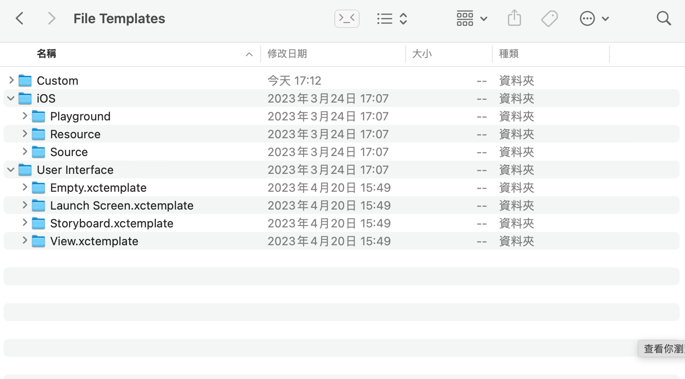
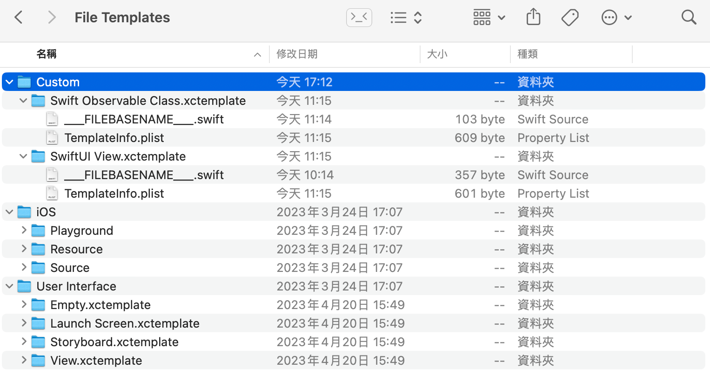
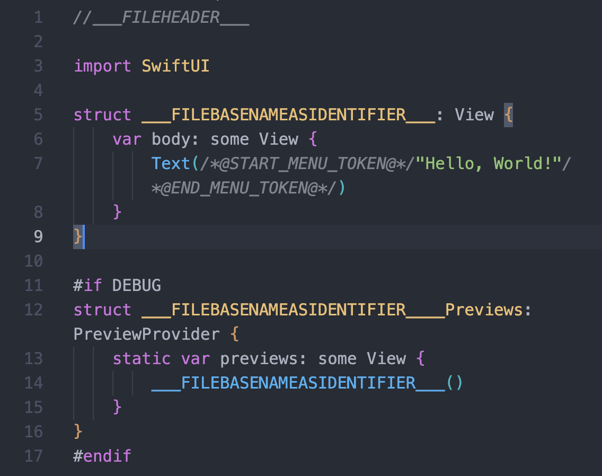
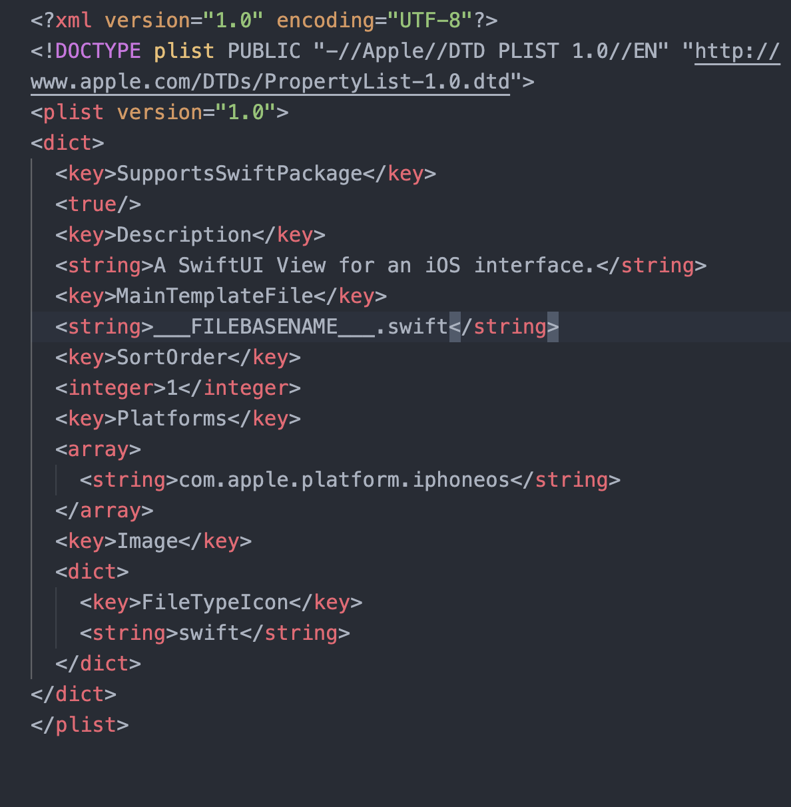

## XcodeCustomTemplate

看到有教程教导如何在Xcode上自定义Cocoa模版，但是没有发现Swift模版，因此编写一下创建Swift相关模版相关方式。

[⚠️ 注意]以下方式是使用Xcode14.3版本，其他版本没有试验

- [模版目录位置]

```bash
/Applications/Xcode.app/Contents/Developer/Platforms/iPhoneOS.platform/Developer/Library/Xcode/Templates/File Templates
```

- [自定义模版目录]

```bash
/Applications/Xcode.app/Contents/Developer/Platforms/iPhoneOS.platform/Developer/Library/Xcode/Templates/File Templates/Custom
```



### 自定义模板

#### 模板文本宏

[文本宏](https://juejin.cn/post/6844903745159954439)

- ```___FILEHEADER___```：头文件
- ```___PROJECTNAME___```：工程名
- ```___FILENAME___```：含后缀文件名
- ```___FILEBASENAME___```：文件名
- ```___DATE___```：日期
- ```___TIME___```：时间
- ```___YEAR___```：年

#### 自定义模板

- 如果是使用Swift模版的，可以copy含有Swift文件的模版放在当前自定义的文件夹下，如图放在```custom```目录下



- 注意

1、模版必须是```.xctemplate```结尾才能识别
2、模版显示的名字为文件夹的名字

- 模版结构

1、TemplateIcon.png 和 TemplateIcon@2x.png 是文件的图标，也可以直接使用默认的文件图标

2、```___FILEBASENAME___```.swfit 模版文件


3、TemplateInfo.plist 模版加载信息 


- ```Description``` 模版描述
- ```MainTemplateFile``` 主模版文件
- ```SortOrder``` 序号
- ```Platforms``` 平台
- ```Image``` 文件图标

